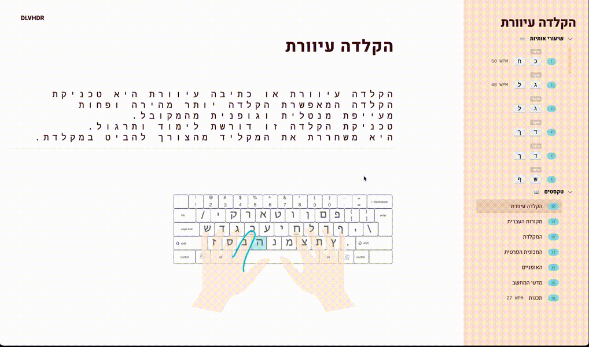

<br />
<p align="center">
  <h2 align="center"><strong>Hebrew Touch Typing</strong></h2>

  <p align="center">
    A website to learn and practice <i>touch typing</i> in Hebrew 🇮🇱
    <br />
    <br />
    <a href="https://typing.dlvhdr.me">✨ View this project live! ✨</a>
  </p>
</p>

<strong><a href="typing.dlvhdr.me">typing.dlvhdr.me</a></strong> helps you learn
touch typing in hebrew.

</img>

## About The Project

Touch typing isn't something officialy learned in Israeli schools but we do
spend a lot of time typing. This site bridges that gap by teaching the correct
finger positions and incrementally introducing more and more keys.

Touch typing can dramatically improve your typing speed and free your mind from
staring at the keyboard. With it, typing becomes more natural.

<!-- TABLE OF CONTENTS -->
<details open="open">
  <summary><h2 style="display: inline-block">Table of Contents</h2></summary>
  <ul>
    <li>
      <a href="#about-the-project">About The Project</a>
      <ul>
        <li><a href="#built-with">Built With</a></li>
      </ul>
    </li>
    <li><a href="#installation">Installation</a></li>
    <li><a href="#usage">Usage</a></li>
    <li><a href="#testing">Testing</a></li>
  </ul>
</details>

### Built With

- [React](https://www.reactjs.org)
- [Typescript](https://www.typescriptlang.org/)
- [SASS](https://sass-lang.com/)
- [React-Testing-Library](https://testing-library.com/)
- [Webpack](https://webpack.js.org/)
- [Figma](https://www.figma.com/)

<!-- GETTING STARTED -->

## Getting Started

To get a local copy up and running follow these simple steps.

1. Clone the repo
   ```sh
   git clone https://github.com/dlvhdr/hebrew-touch-typing.git
   ```
2. Install NPM packages
   ```sh
   npm install
   ```

## Usage

Follow the lessons in order for best results.

<ol>
  <li>Learn the keys positions and which fingers to hit each key with</li>
  <li>Once the entire keyboard is covered, practice some real life texts from wikipedia</li>
</ol>

## Testing

To run the tests simply run:

```sh
npm test
```
